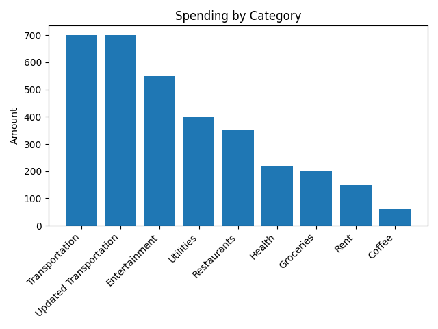
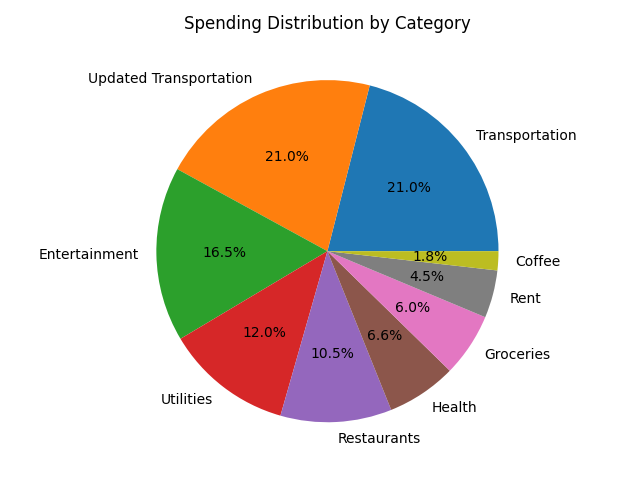
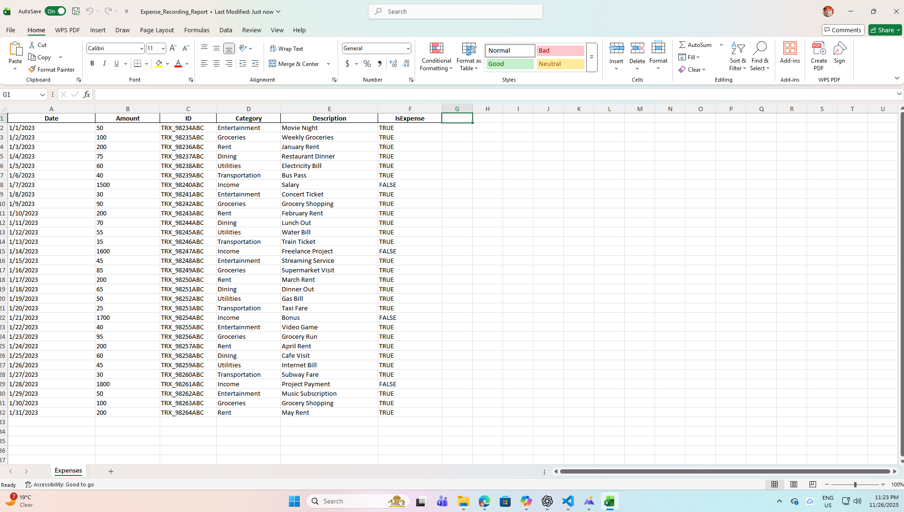

# Expense Tracker Application (CLI + GUI Version)


This project is a complete **Expense Tracking System** built using Python.  
It includes **two fully functional applications**:

1. **CLI Version (Command Line Interface)** – Runs in terminal  
2. **GUI Version (Tkinter Frontend)** – Includes charts, category management, and PDF report generation

This README provides installation, usage instructions, and a technical overview.

---

## 🚀 Features

### ✔ 1. Expense Categorization
- Add, edit, delete categories  
- Predefined + user-defined custom categories  
- Assign category to every expense  
- Predictive category suggestions (bonus)

### ✔ 2. Budgets per Category (Bonus)
- Set monthly budgets for each category  
- 80% usage warning  
- Exceed usage alert

### ✔ 3. Recurring Expenses (Bonus)
- Mark any expense as recurring  
- Automatic rollover for new month

### ✔ 4. GUI Application (Tkinter)
- Form UI to add expenses  
- Dropdown category selector  
- Full category management screen  
- Export CSV  
- Generate monthly PDF financial report  
- View bar chart + pie chart analytics  
- Uses:
  - Tkinter  
  - Matplotlib  
  - ReportLab (PDF)

### ✔ 5. Data Storage (JSON)
All data stored locally using JSON:
- `data/categories.json`  
- `data/expenses.json`

### ✔ 6. PDF Reporting (Bonus)
PDF includes:
- Monthly summary  
- Total per category  
- Percentage breakdown  
- Highest + lowest spending category  
- Auto-generated charts

---

## 📁 Project Structure

```text
Expense_Recording_System/
├── .venv/                        # Virtual environment (ignored via .gitignore)
├── data/                         # Expense data files
│   ├── categories.json           # Stores category definitions
│   ├── expenses.json             # Stores expense records
│   └── Expense_Recording_Report.xlsx # Sample Excel report (reference)
├── Screenshots/                  # GUI snapshots and demo images
├── Expense_Tracker.py            # Core CLI logic for expense tracking
├── Expense_Tracker_GUI.py        # Tkinter-based GUI application
├── Expense_Report.csv            # Sample CSV export
├── Expense_Tracker_Presentation.pptx # Presentation slides
├── Expense_Tracker_Report.pdf    # Generated PDF report
├── README.md                     # Markdown documentation
├── README.txt                    # Text documentation
├── requirements.txt              # Python dependencies
``` 
## 📦 Installation & Usage

### 1. Create and activate virtual environment
```bash
python -m venv .venv
.venv\Scripts\activate   # Windows (cmd)
source .venv/bin/activate # Linux/Mac
```
### 2. Install core dependencies
```bash 
pip install -r requirements.txt
```
### 3. (Optional) Install additional libraries for GUI + PDF reporting
```bash
pip install matplotlib reportlab pillow
```
### 4. Run CLI version
```bash
python Expense_Tracker.py
```
### 5. Run GUI version
```bash
python Expense_Tracker_GUI.py
```

## 📜 Dependencies
```text
tkinter (built-in)
pandas==2.2.2
matplotlib==3.9.2
reportlab==4.2.0
pillow==10.4.0
```
## 📸 Screenshots

Below are snapshots of the Expense Tracker GUI, category management, and reporting features.

### Main GUI Screen


### Add Expense (Zoomed View)


### Manage Categories


### Category Totals Chart


### Category Pie Chart


### Monthly Summary


### Monthly Summary Dashboard


### Summary Dashboard (Zoomed)


### Expense Report Overall View


### Expense Report Excel View


---
## 🧪 Testing
Tests are located in the tests/ directory and cover expense addition, category management, and report generation.
```bash
pytest
```
## 🤝 Contributing
Contributions, issues, and feature requests are welcome! Feel free to open an issue or submit a pull request. For major changes, please open an issue first to discuss what you would like to change.

## 🧑‍💻 Author
Developed by **Anish Wadatkar**

## 📜 License
This repository is licensed under the MIT License.